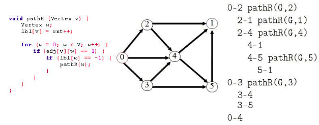

# Grafos1_Juiz-Online

**Número da Lista**: 35<br>
**Conteúdo da Disciplina**: Grafos 1<br>

## Alunos
|Matrícula | Aluno |
| -- | -- |
| 18/0023161  |  Luíz Gustavo Ferreira Rocha |
| 19/0038969  |  Victor Hugo Carvalho Silva |

## Sobre 
&emsp;As questões presentes neste repositório foram retiradas do juiz eletrônico online [beecrowd](https://www.beecrowd.com.br/) com o fim de exercitar os conhecimentos da dupla em relação ao conteúdo de Grafos 1.

## Screenshots
Adicione 3 ou mais screenshots do projeto em funcionamento.


## Instalação 
**Linguagem**: C e Python 3.10.<br>

## Uso
### 2959 | Credo com ParaTudo!

&emsp;Harari era um jovem muito inteligente e que gostava muito de comer e beber. Certo dia, saiu com seus amigos, e após uma noitada de muitas risadas e bons drink’s, teve a ideia de comprar um iogurte de gengibre muito bom que estava em moda no momento, chamado ParaTudo. Ao tomar com seus amigos, percebeu que o iogurte realmente parava todo o seu sistema digestivo e todo mundo entrou em pânico precisando ir cada um para sua respectiva casa.

&emsp;Devido aos bons drinks que tomaram, os amigos estavam perdidos na cidade, e tinham medo de não conseguir chegar em suas casas, ainda mais que muitas ruas estavam interditadas devido ao Carnaval que estava por chegar.

&emsp;Dado o número de bairros da cidade e suas conexões (todas essas conexões sendo possíveis de ser atravessadas pelos dois sentidos), responda às várias perguntas de Harari e seus amigos, em que cada pergunta deve responder se, a partir de um bairro A, é possível chegar a um bairro B pelas conexões disponíveis.

#### Entrada

&emsp;A primeira linha da entrada contém três inteiros **N** (0 < **N** ≤ 400), **M** (0 ≤ **M** ≤ (( **N** -1)* **N** ))/2) e **P** (0 ≤ **P** ≤ 105), indicando respectivamente o número de bairros, o número de conexões da cidade de Harari e quantas perguntas foram feitas. As próximas **M** linhas descrevem as conexões, em que cada linha há 2 inteiros, **A** e **B** (0 < **A** , **B** ≤ **N**) indicando que tal conexão conecta esses dois bairros. As próximas **P** linhas descrevem as perguntas feitas, onde, em cada linha, haverá dois inteiros, **K** e **L**, perguntando se é ou não possível ir de **K** a **L** pelas conexões disponíveis.

#### Saída

Para cada pergunta, deve haver uma das seguintes respostas:<br>
&emsp;“Lets que lets”, se é possível chegar de um bairro ao outro;<br>
&emsp;“Deu ruim”, se não é possível chegar de um bairro ao outro.
<br>

##### Execute no terminal
```
python3 ccpt.py 
```
##### Exemplo de Entrada
~~~
8 5 9
7 3
5 1
2 7
5 2
4 2
7 2
8 2
3 2
6 2
4 8
7 6
3 8
2 5
4 3

~~~

##### Exemplo de Saída
~~~
Lets que lets
Deu ruim
Lets que lets
Deu ruim
Deu ruim
Deu ruim
Deu ruim
Lets que lets
Lets que lets
~~~
<br><br>
### 1081 | DFSr - Depth Hierarchy

&emsp;Em gráficos, a função PathR é bem conhecida. É chamado dfs ou dfsr . Significa uma busca recursiva em profundidade nos nós de um grafo, usando backtracking. A tarefa aqui é, a partir de um grafo de entrada, gerar o desenho hierárquico dos nós pesquisados.Para ajudá-lo, é fornecido o procedimento PathR, listado acima.



#### Entrada

&emsp;O arquivo de entrada contém muitos casos de teste. A primeira linha do arquivo de entrada contém um inteiro **N** que representa a quantidade de casos de teste a seguir. Cada um dos **N** casos de teste contém, na primeira linha, duas informações: (1 ≤ **V** ≤ 20) e **E** (1 ≤ **E** ≤ 20), que são respectivamente a quantidade de vértices e arestas do grafo. Siga **E** linhas contendo informações sobre todas as arestas deste grafo.

#### Saída

&emsp;Para cada caso de teste, deve ser impressa uma saída que represente uma busca em profundidade para todos os nós, respeitando a hierarquia de cada um deles. O caractere b significa um espaço em branco. Veja o seguinte exemplo:<br>
&emsp;**bb**0-2 pathR(G,2)<br>
&emsp;**bbbb**2-1 pathR(G,1)<br>
&emsp;**bbbb**2-4 pathR(G,4)<br>
&emsp;**bbbbbb**4-1<br> <br>
&emsp;E assim por diante...<br>
&emsp;Obs.: O programa deve imprimir uma linha em branco após cada caso de teste, mesmo após o último caso de teste.<br>

##### Execute no terminal

Para compilar com o gcc:
```
gcc -o depthHierarchy depthHierarchy.c
```

Executar:
```
./depthHierarchy
```

##### Exemplo de Entrada
~~~
2
12 9
0 1
1 5
5 6
0 4
4 2
2 3
7 8
1 7
10 11
11 8
0 1
1 2
3 4
4 3
5 6
6 8
7 9
9 10

~~~

##### Exemplo de Saída
~~~
Caso 1:
  0-1 pathR(G,1)
    1-5 pathR(G,5)
      5-6 pathR(G,6)
    1-7 pathR(G,7)
      7-8 pathR(G,8)
  0-4 pathR(G,4)
    4-2 pathR(G,2)
      2-3 pathR(G,3)

  10-11 pathR(G,11)

Caso 2:
  0-1 pathR(G,1)
    1-2 pathR(G,2)

  3-4 pathR(G,4)
    4-3

  5-6 pathR(G,6)
    6-8 pathR(G,8)

  7-9 pathR(G,9)
    9-10 pathR(G,10)
 

~~~
## Outros 
Quaisquer outras informações sobre seu projeto podem ser descritas abaixo.


